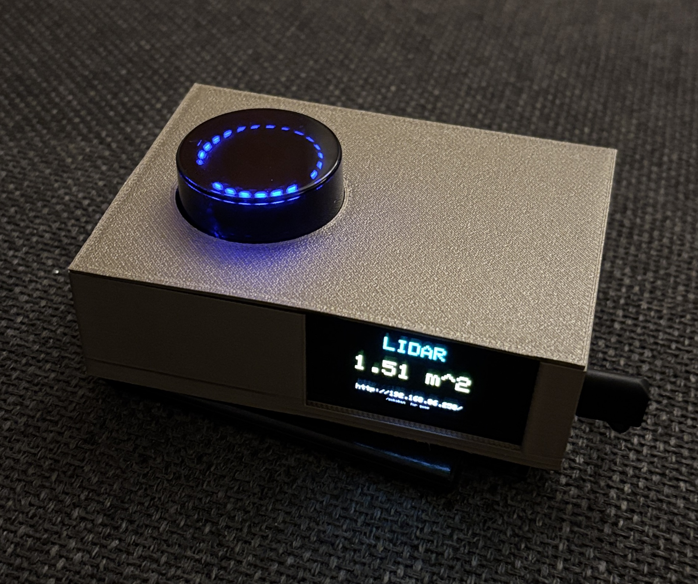
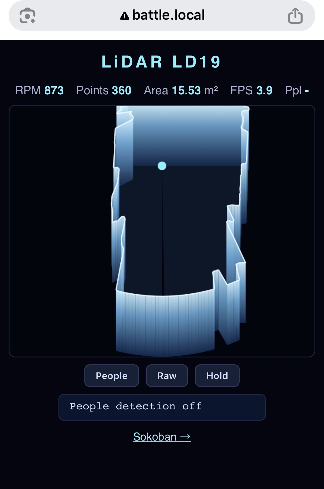
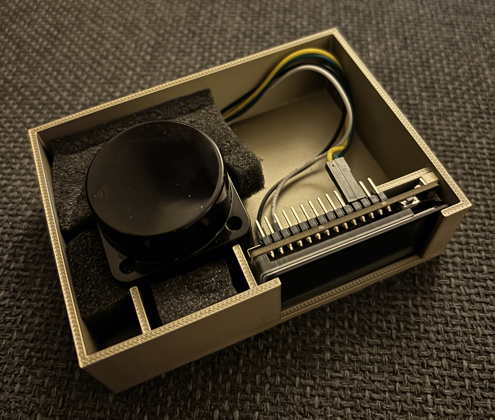
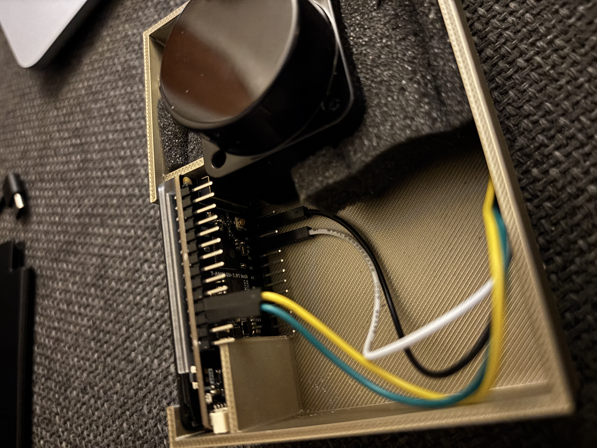
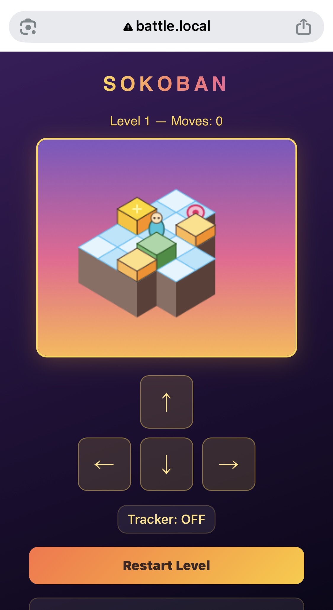

# ESP32 LD19 LiDAR Project

This project implements a portable LiDAR scanner and visualization tool using a **LilyGo T-Display-S3** (ESP32-S3 with AMOLED display) and an **LD19 LiDAR** sensor.



*The assembled LiDAR scanner in its custom enclosure.*

## Features

- **Real-time Visualization:** Displays live LiDAR point cloud data on the 536x240 AMOLED screen.
- **Touch UI:** On-screen buttons (CST816 capacitive touch) to toggle person tracking, an area-only view, the IMU readout, and recording.
- **IMU:** Optional BMI160 (accel + gyro) for motion deskew; shown live on screen and logged with the LiDAR.
- **On-device Recording:** Logs synchronized LiDAR + IMU to the onboard flash as `.ldim`, downloadable over WiFi.
- **Host Toolchain:** Pull recordings and turn them into floorplans, MCAP, or an interactive 3-D view (`tools/`).
- **Web Interface:** Includes a built-in web server to monitor data and configure the device over WiFi.
- **Custom Enclosure:** A two-piece 3D-printable snap-fit box designed specifically for these components.
- **Integrated Game:** Includes a built-in Sokoban game (reachable via the display/buttons).
- **Closed-loop Speed Control:** Holds the LiDAR at a default 10 Hz for consistent data acquisition.

## Hardware

- **MCU:** [LilyGo T-Display-S3 AMOLED](https://www.lilygo.cc/products/t-display-s3) (ESP32-S3, RM67162 536×240 AMOLED)
- **LiDAR:** LD19 LiDAR Sensor — RX on GPIO 44, speed PWM on GPIO 46
- **Touch:** CST816 capacitive controller (on-board, I²C bus 0 — SDA 3 / SCL 2, addr 0x15)
- **IMU (optional):** BMI160 accel + gyro on a second I²C bus (SDA 41 / SCL 39, addr 0x69), mounted with **+Y up**
- **Enclosure:** Custom 3D-printed case (see `build_box.py`)



*Internal layout and component fitting.*



*LiDAR and T-Display seated in the bottom enclosure.*



*Detail of the wiring connection between the MCU and the sensor.*

## Software Setup

### Firmware
The firmware is written in C++ for the Arduino framework. It uses the `Arduino_GFX` library for the AMOLED display.

**Build Requirements:**
- `arduino-cli`
- ESP32 Board Support (esp32:esp32:esp32s3)

To compile and flash:
```bash
make
```

### WiFi Setup

On first boot — or any boot with no stored credentials — the device starts a SoftAP captive setup:

1. Connect your phone or laptop to the WiFi network **`lidar-setup`** (open, no password).
2. Open **http://192.168.4.1/** in a browser. The setup page scans for nearby networks.
3. Tap an SSID to fill the field (or type it manually), enter the password, and press **Connect**.
4. The device stores the credentials in flash and reboots. The AMOLED then shows the station-mode URL (typically `http://lidar.local/` via mDNS).

To re-do setup later, open a serial console at 115200 baud and type one of:

- `clear` — wipes stored WiFi credentials and reboots into setup mode
- `reboot` — restart the device
- `help` — list commands

### Sokoban

The device serves a built-in Sokoban game at **http://lidar.local/sokoban** (or `/sokoban` on whichever IP is shown on the display).



*Sokoban running on the embedded web server, rendered isometrically.*

Push the green crates onto the pink goal pads. Each pad must hold one crate to clear the level — there are 50 levels in total, advancing automatically when the last crate is placed. Crates can only be pushed (never pulled) and only when the square behind them is empty, so plan ahead.

Two control modes:

- **D-pad / arrow keys** — tap the on-screen pad or use arrow keys on a desktop.
- **LiDAR motion control** — toggle **Tracker: ON** to stand in front of the sensor and step into one of the four direction cells in the 3×3 floor grid (the centre cell is "idle"). Each cell-entry fires one move; you have to step back to idle before re-entering the same cell.

### Touch Controls

The AMOLED's capacitive panel drives a four-button bar along the bottom of every screen:

- **TRACK** — toggle firmware person detection on/off (area measurement keeps running).
- **AREA** — full-screen scanned-area (m²) readout.
- **IMU** — live BMI160 readout (accel in g, gyro in dps, roll/pitch). Use it to align the mount: when upright the up axis reads ~+1.00 g and roll/pitch sit near 0.
- **REC** — start/stop recording. While recording the button turns red and shows the file size.

The LiDAR spins at a default **10 Hz** (closed-loop) from boot.

To sanity-check the touch panel in isolation, flash the standalone test sketch (it scans I²C and live-tracks touches), then re-flash the main firmware:

```bash
make touch-flash    # flash touch_test/
make flash          # restore the LiDAR firmware
```

### Recording & Floorplans

Recordings are written to the onboard FAT partition as `scan_NNN.ldim` (raw LD19 packets + mount-corrected IMU samples, the same format as the companion `rasp_pi_zero2_ld19_lidar` project). A host-side toolchain in `tools/` pulls them over WiFi and processes them.

```bash
make pull-recordings          # download new .ldim from the device into recordings/
make list-recordings          # list what's on the device (no download)
make floorplan                # gyro-deskew + ICP + loop-closure floorplan PNG
make viz                      # interactive PRBonn lidar-visualizer (auto-builds MCAP)
make mcap                     # just convert .ldim -> MCAP
make view                     # quick static matplotlib scatter
```

All processing targets default to the newest recording; override with `LDIM=recordings/scan_002.ldim`, and the device host with `HOST=lidar.local`. The Python venv (`tools/.venv`) is created automatically and **pins Python 3.13** — the visualizer / `rosbags` lack wheels for 3.14. `make viz` clones [PRBonn/lidar-visualizer](https://github.com/PRBonn/lidar-visualizer) on demand.

Recordings can also be managed over a 115200-baud serial console: `ls` (list), `rm <file>`, `i2c` (scan both buses for the touch/IMU controllers).

### Enclosure Design
The 3D-printable box is generated using a Python script that leverages geometric libraries.

**Requirements:**
- Python 3
- `numpy`
- `trimesh`
- `shapely`

To generate the STL files:
```bash
python3 build_box.py
```
This will produce `lidar_tdisplay_box_bottom.stl` and `lidar_tdisplay_box_top.stl`.

## File Structure

- `esp32-ld19-lidar.ino`: Main Arduino firmware.
- `lidar_page.h`, `sokoban_page.h`, `setup_page.h`, `sokoban_levels.h`, `localizer.h`: Web-page HTML, Sokoban data, and the localizer, included by the sketch.
- `touch_test/`: Standalone CST816 touch-panel test sketch (`make touch-flash`).
- `tools/`: Host `.ldim` toolchain — `pull_recordings.py`, `view_ldim.py`, `ldim_to_floorplan.py`, `ldim_to_mcap.py`, `ldim_dump.py`.
- `build_box.py`: Python script to generate the 3D enclosure.
- `makefile`: Build system for the firmware and the host toolchain.
- `*.stl`: Generated 3D models for printing.
- `IMG_*.jpeg`: Project photos.
